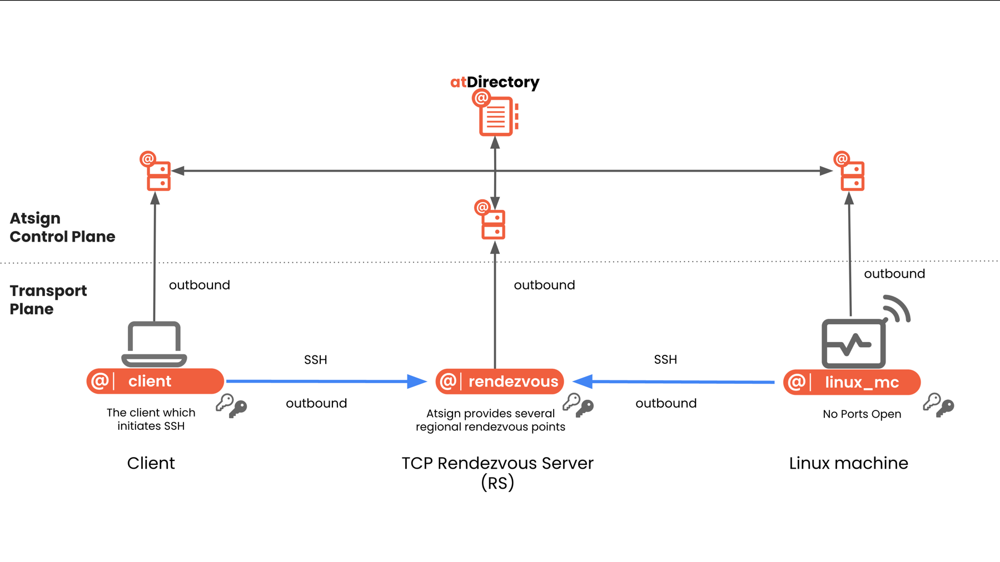

# What's happening under the hood?

**Note**: This document describes version 3.5.0 or greater; v3.5.0 will be
released mid-August 2023

## Overview
There are three atSigns involved - one for each of
- the noports daemon program (`sshnpd`) which runs on the device you want to 
  ssh to
- the noports client program (`sshnp`) which you run on the device you want to 
  ssh from
- the noports tcp rendezvous program (`sshrvd`)

The programs communicate via the atProtocol and the atClient SDKs; as a 
result, the payloads of the messages the programs send to each other are all 
end-to-end encrypted.

In brief
- The client (`sshnp`) creates a unique guid for the session
  - and sends a request notification to the `sshrvd` for an available host:port 
    for this sessionId (and receives a response notification)
  - and sends a request notification to the `sshnpd` including the sessionId 
    and the host:port
- The daemon (`sshnpd`) opens a socket to the host:port, and writes the 
  sessionId on it
  - and opens a socket to its local sshd port
  - and bridges the sockets together
  - and sends a response notification to the `sshnp` client
- The client opens a socket to the host:port
- The user may now `ssh -p $port $username@$host`

This high-level flow is visualized in the diagram below.

**NB** Requests from unauthorized client atSigns are ignored. Note that one
may also completely prevent requests from any other atSigns ever even
reaching the daemon by using the atProtocol's `config:allow` list feature.
> In the personal edition of noports, a daemon may have only a single
> authorized client atSign.
>
> The Team and Enterprise editions will allow for multiple authorized client
> atSigns, controlled not by the daemon but by a separate noports
> authorization controller process, with its own atSign.

## Detail
In the sections above, we referred to "authentication", "sending 
notifications" and "receiving notifications", and we made the statement that
"the payloads of the messages the programs send to each other are all
end-to-end encrypted"

Here are some links to detailed diagrams covering
- [how atClients authenticate](https://github.
  com/atsign-foundation/at_protocol/blob/trunk/decisions/2023-01-pkam-per-app-and-device.md#appendix---current-flows) to their atServers
- [how encrypted data is exchanged](https://github.
  com/atsign-foundation/at_protocol/blob/trunk/usage-examples/how-to-exchange-encrypted-data.md) (including how keys are exchanged)
- [how notifications work](https://github.
  com/atsign-foundation/at_protocol/blob/trunk/usage-examples/how-notifications-work.md)
